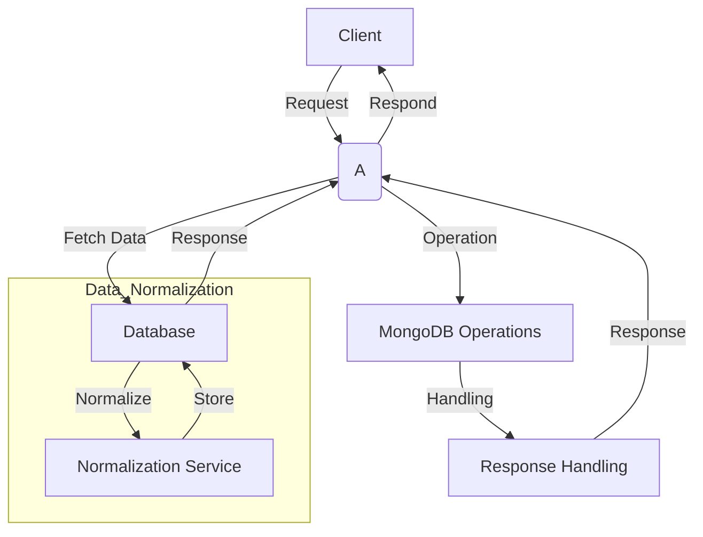

# Architecture Overview

This document provides a visual representation of the system architecture for the Bysen project.

## System Architecture Diagram

## Architecture Components

- **Client**: The application client making requests
- **API Endpoint**: Main API entry point handling all requests and responses
- **Database**: Primary data storage and retrieval
- **Data Normalization**: Service responsible for data normalization and consistency
- **MongoDB Operations**: Handling MongoDB-specific operations
- **Response Handling**: Processing and formatting responses back to the client

## Data Flow

1. Client sends a request to the API Endpoint
2. API Endpoint fetches data from the Database
3. Database returns the requested data
4. Data goes through normalization if needed
5. MongoDB operations are performed as required
6. Response is handled and formatted
7. Final response is sent back to the Client