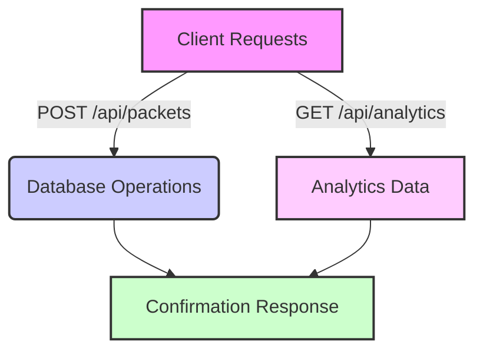

# Bysen Application Architecture

## Overview
This document describes the architecture of the Bysen application, highlighting the key flows and processes involved.

## API Flows

### POST /api/packets Flow
1. Client sends a POST request to /api/packets.
2. Server validates the request.
3. Application processes the packet and updates the database.
4. Confirmation response is sent back to the client.

### GET /api/analytics Flow
1. Client sends a GET request to /api/analytics.
2. Server fetches analytics data from the database.
3. Data is processed and formatted.
4. Response is sent back to the client with analytics data.

## Server Startup Process
1. Load configurations and environment variables.
2. Initialize database connections.
3. Start listening for incoming requests on the designated port.

## Mermaid Diagram
