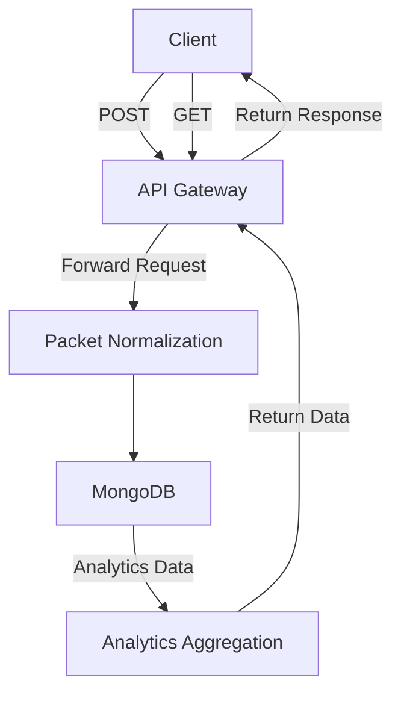

```mermaid
flowchart TD
    A[Client] -->|POST| B[API Gateway]
    A -->|GET| B
    B -->|Forward Request| C[Packet Normalization]
    C --> D[MongoDB]
    D -->|Analytics Data| E[Analytics Aggregation]
    E -->|Return Data| B
    B -->|Return Response| A
```